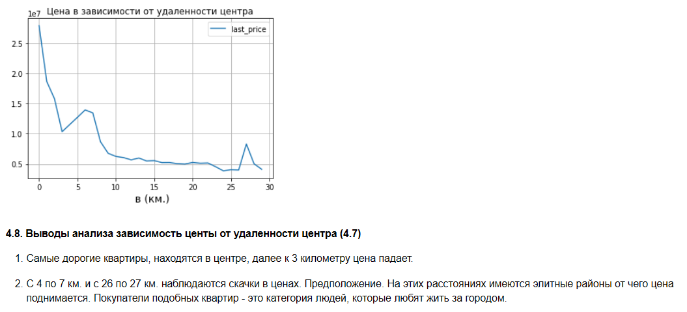

# Исследование объявлений о продаже квартир

### Анализ рынка недвижимости Санкт-Петербурга и определение параметров, влияющих на цену (Первый проект Яндекс.Практикум)

**Задача**: На основе данных сервиса Яндекс.Недвижимость определить рыночную стоимость объектов и выявить параметры, влияющие на цену квартир в Санкт-Петербурге и области.

### 🚀 Основные результаты
- Цена сильно зависит от **площади**, **удалённости от центра** и **этажа** (первый/последний дешевле).
- Обнаружены аномалии: квартиры с потолками > 10 м, площадью > 300 м².
- Средняя цена в центре СПб в 2–3 раза выше, чем в области.
- Корреляция цены с количеством комнат, этажностью и днем публикации объявления.

### 📊 Превью графиков

### 🛠 Технологический стек
- **Python 3.9.5**
- **Библиотеки**: pandas, numpy, matplotlib, seaborn
- **Jupyter Notebook**

### 📓 Ноутбук проекта
Полный исследовательский анализ данных (EDA): очистка, обработка аномалий, визуализация, выводы.

[Открыть на GitHub](https://github.com/Dayana373/First_yandex_project/blob/main/first_project.ipynb)

### 📁 Данные
Данные сервиса Яндекс.Недвижимость (объявления о продаже квартир в СПб и области):

[Скачать датасет](https://disk.yandex.ru/d/TwN75vrjKPDQRw)

### 👩‍💻 Автор
Диана Сергеева  
Junior Data Scientist  
GitHub: [@Dayana373](https://github.com/Dayana373)
